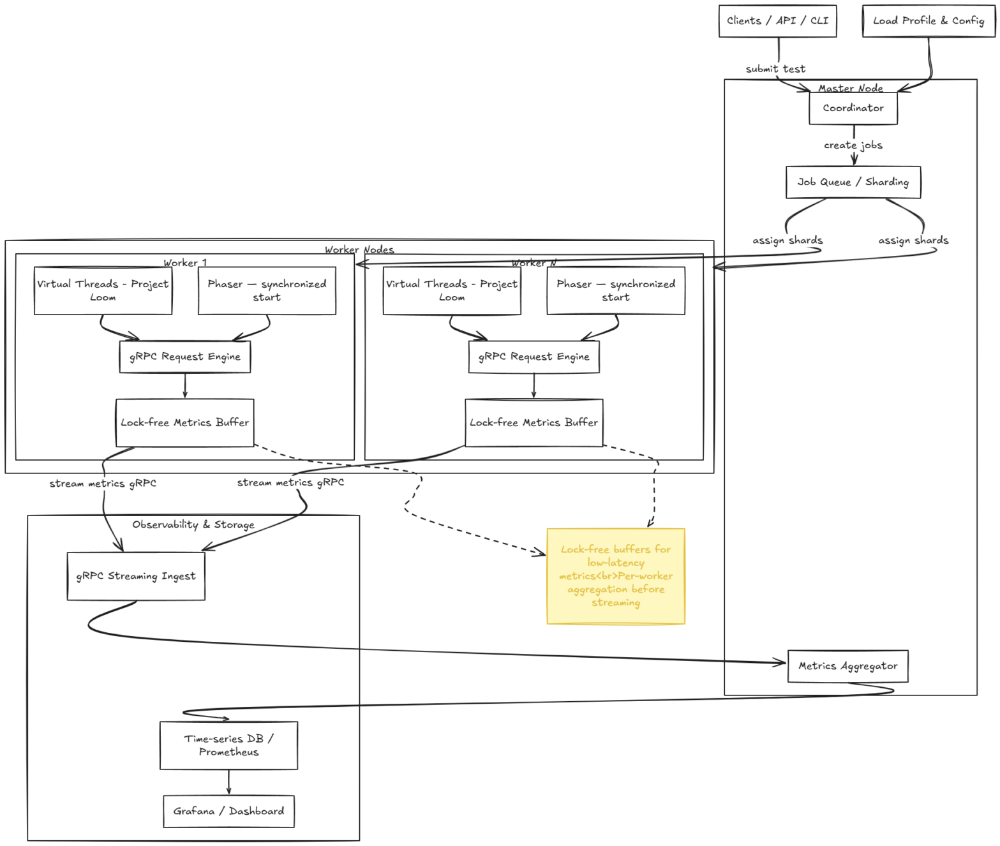

# Distributed Load Testing Platform

> Distributed load testing engine built with Java 21 Virtual Threads, gRPC, and lock-free metrics collection.

Features a Master-Worker architecture capable of generating millions of requests per second with sub-millisecond metric precision.

## Architecture Overview



## Key Technical Features

### 1. Virtual Threads (Project Loom)

```java
// Traditional approach - limited by thread pool size
ExecutorService bounded = Executors.newFixedThreadPool(200); // 200 threads = ~200MB

// Virtual Threads approach - millions of concurrent tasks
ExecutorService virtual = Executors.newVirtualThreadPerTaskExecutor(); // Unlimited!
```

**Benefits:**
- Each virtual thread consumes ~1KB (vs 1MB for platform threads)
- Enables millions of concurrent connections
- Zero modification required for blocking I/O code
- Automatic M:N scheduling by JVM

### 2. Lock-Free Metrics Collection

```java
// Instead of AtomicLong (contention bottleneck at high RPS)
AtomicLong counter = new AtomicLong();
counter.incrementAndGet(); // CAS loop under contention

// Use LongAdder (striped counters per CPU cache line)
LongAdder counter = new LongAdder();
counter.increment(); // ~10-20x faster under high contention
counter.sum();       // Eventually consistent reading
```

### 3. Synchronized Burst Testing (Phaser Pattern)

```java
// All Virtual Threads wait at the barrier
Phaser phaser = new Phaser(workerCount + 1); // +1 for coordinator

// Workers call this
phaser.arriveAndAwaitAdvance(); // Block until all arrive

// Coordinator releases all simultaneously
phaser.arriveAndDeregister(); // "Starting gun" fired
```

### 4. gRPC Streaming for Metrics

```
Worker                              Master
  │                                   │
  │──── MetricsBatch (500ms) ───────►│
  │──── MetricsBatch (500ms) ───────►│
  │──── MetricsBatch (500ms) ───────►│
  │     ...                           │
  │                                   │
  │◄───────── Ack ───────────────────│
```

Batching reduces per-message overhead from ~100 bytes to <1 byte amortized.

## Project Structure

```
distributed-load-test-platform/
├── pom.xml                          # Parent POM with dependency management
├── docker-compose.yml               # Local development stack
│
├── load-balancer-common/            # Shared module
│   ├── pom.xml
│   └── src/main/
│       ├── proto/
│       │   └── scenario.proto       # gRPC schema definitions
│       └── java/io/loadtest/common/
│           ├── model/
│           │   ├── HttpScenario.java    # Sealed interface with Records
│           │   ├── LoadProfile.java      # Load profile definitions
│           │   └── RequestMetric.java    # Metric data structure
│           ├── metrics/
│           │   └── MetricsCollector.java # Lock-free metrics collection
│           └── parser/
│               └── ScenarioParser.java   # JSON/YAML config parser
│
├── load-balancer-master/            # Spring Boot control plane
│   ├── pom.xml
│   ├── Dockerfile
│   └── src/main/
│       ├── resources/
│       │   └── application.yml
│       └── java/io/loadtest/master/
│           ├── MasterApplication.java           # Spring Boot entry point
│           ├── controller/
│           │   └── ScenarioController.java      # REST API endpoints
│           ├── grpc/
│           │   ├── MasterGrpcService.java       # gRPC worker endpoint
│           │   └── WorkerGrpcClient.java         # Worker communication client
│           ├── registry/
│           │   └── WorkerRegistry.java          # Redis-backed worker state
│           ├── metrics/
│           │   └── AggregatedMetricsStore.java   # Metrics aggregation
│           └── service/
│               └── ScenarioOrchestrationService.java
│
└── load-balancer-worker/            # Vanilla Java 21 load generator
    ├── pom.xml
    ├── Dockerfile
    └── src/main/java/io/loadtest/worker/
        ├── WorkerMain.java                      # Worker entry point
        ├── engine/
        │   └── VirtualThreadLoadGenerator.java # Core engine with Phoenix
        └── grpc/
            └── WorkerGrpcService.java          # gRPC master endpoint
```

## Quick Start

### Prerequisites

- Java 21 LTS
- Docker & Docker Compose
- Maven 3.9+

### Local Development

```bash
# Clone and build
git clone <repo-url>
cd distributed-load-test-platform
./mvnw clean install -DskipTests

# Start infrastructure (Redis, InfluxDB, Grafana)
docker-compose up -d redis influxdb grafana

# Run Master (Terminal 1)
cd load-balancer-master
../mvnw spring-boot:run

# Run Worker (Terminal 2)
cd load-balancer-worker
../mvnw exec:java -Dexec.mainClass="io.loadtest.worker.WorkerMain"

# Or run everything with Docker
docker-compose up --scale worker=3
```

### API Usage

```bash
# Create a test scenario
curl -X POST http://localhost:8080/api/v1/scenarios \
  -H "Content-Type: application/json" \
  -d '{
    "name": "API Stress Test",
    "url": "https://httpbin.org/get",
    "method": "GET",
    "targetRps": 10000,
    "durationSeconds": 60,
    "maxConcurrency": 5000,
    "loadProfileType": "rampup",
    "rampUpSeconds": 10,
    "tags": {"env": "dev", "service": "httpbin"}
  }'

# Response: {"scenarioId": "abc-123", "status": "QUEUED", ...}

# Start the test
curl -X POST http://localhost:8080/api/v1/scenarios/abc-123/start

# Check status
curl http://localhost:8080/api/v1/scenarios/abc-123/status

# Get final results
curl http://localhost:8080/api/v1/scenarios/abc-123/results

# List connected workers
curl http://localhost:8080/api/v1/scenarios/workers
```

## Load Profile Types

### Constant Load
```json
{
  "loadProfileType": "constant",
  "targetRps": 50000,
  "durationSeconds": 300
}
```

### Ramp-Up (Progressive)
```json
{
  "loadProfileType": "rampup",
  "targetRps": 100000,
  "rampUpSeconds": 60,
  "durationSeconds": 180,
  "rampDownSeconds": 30
}
```

### Spike Test (Synchronized Burst)
```json
{
  "loadProfileType": "spike",
  "targetRps": 500000,
  "durationSeconds": 10,
  "synchronizedStart": true
}
```

### Step Test (Incremental)
```json
{
  "loadProfileType": "stepup",
  "initialRps": 10000,
  "rpsIncrement": 5000,
  "durationSeconds": 180,
  "totalSteps": 6
}
```

## Technology Stack

| Component | Technology | Purpose |
|-----------|------------|---------|
| **Runtime** | Java 21 LTS | Virtual Threads, ZGC |
| **Master Framework** | Spring Boot 3.x | REST API, DI, Actuator |
| **Worker Framework** | Vanilla Java 21 | Zero-overhead load generation |
| **Inter-node Comms** | gRPC + Protobuf | Low-latency streaming |
| **Worker Registry** | Redis | Health tracking, work assignment |
| **Metrics Storage** | InfluxDB/ClickHouse | Time-series data |
| **Visualization** | Grafana | Real-time dashboards |

## JVM Configuration

### Master Node
```bash
java --enable-preview \
     -XX:+UseZGC -XX:+ZGenerational \
     -XX:+UseContainerSupport \
     -Xms1g -Xmx4g \
     -jar load-balancer-master.jar
```

### Worker Node (Critical for Latency Accuracy)
```bash
java --enable-preview \
     -XX:+UseZGC -XX:+ZGenerational \
     -XX:+UnlockExperimentalVMOptions \
     -XX:ZAllocationSpikeTolerance=5 \
     -Xms512m -Xmx2g \
     -XX:+ExitOnOutOfMemoryError \
     -Xlog:gc*:file=gc.log:time,uptime,level,tags \
     -jar load-balancer-worker.jar
```

**Why ZGC?**
ZGC (Z Garbage Collector) guarantees pause times under 1ms. Traditional garbage collectors (G1GC, ParallelGC) can cause pause times of 50-500ms, which would corrupt latency measurements during load tests.

## Performance Characteristics

| Metric | Value | Notes |
|--------|-------|-------|
| Max Single-Worker RPS | 500K+ | Limited by network, not CPU |
| Max Distributed RPS | 10M+ | Horizontal scaling |
| Latency Measurement Precision | ±1ms | ZGC pause guarantee |
| Memory per Worker | 512MB-2GB | Tuned via heap sizing |
| Worker Start Time | ~500ms | Virtual Thread instantiation |
| Metric Collection Overhead | <0.1% | Lock-free LongAdder |

## License

Apache License 2.0

## Author

Senior Staff Software Engineer / SDET Portfolio Project
